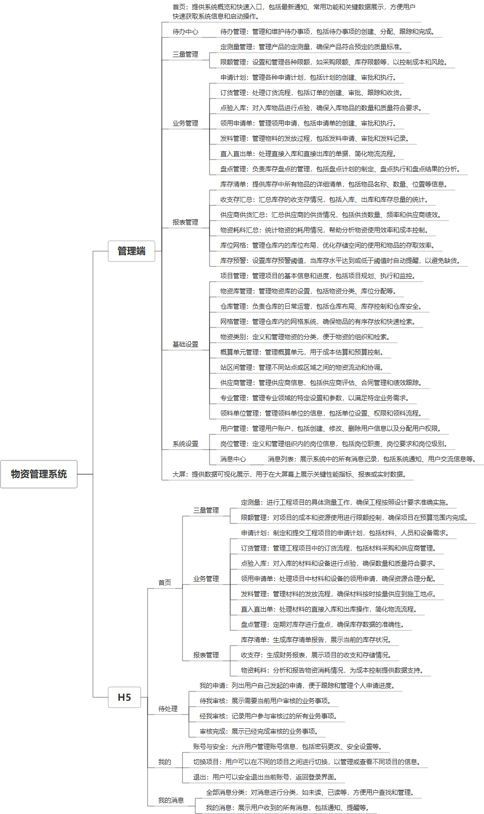

 

    
 

公司拥有上百套具有自主知识产权的软件系统，详情请查看码云首页或公司官网

 
<h1>物资管理系统</h1>

<a href="https://www.haishi.net.cn/">公司官网</a> ｜ <a href="https://www.haishi.net.cn/">在线体验</a>

 

## 系统介绍

物资管理系统是一款全面的企业资源管理软件，它通过集成物资采购、库存控制、出库管理、入库记录、审批流程、统计分析等功能，实现对物资全生命周期的精细化管理，确保资源合理配置，降低成本，并为企业提供实时数据支持和高效的决策辅助。
物资管理系统是一款全面的企业资源管理软件，它通过集成物资采购、库存控制、出库管理、入库记录、审批流程、统计分析等功能，实现对物资全生命周期的精细化管理，确保资源合理配置，降低成本，并为企业提供实时数据支持和高效的决策辅助。
本项目名称为物资管理系统，实现对物资从申请计划、订货管理、点验入库、领用申请、发料管理、直入直出、盘点管理等全流程管理。
本系统适用于企业、政府机关、事业单位等所有涉及物资管理的单位，帮助其规范物资管理流程，提高物资使用效率，降低物资损耗。
本项目的用户为系统管理员、普通用户等，可以通过web端浏览器登录系统。
- 系统管理员：可以进行系统设置、用户管理、岗位管理等操作。
- 普通用户：可以进行业务操作，例如：申请计划、订货管理、点验入库、领用申请、发料管理、直入直出、盘点管理等。
                

## 系统功能介绍

### 系统包含终端说明

管理端（WEB）、用户端（H5）

| 序号 | 模块              | 模块说明 |
| ---- | ----------------- | -------- |
| 1    | ZF-WZGL-GT-H5     | H5端     |
| 2    | ZF-WZGL-GT-MANAGE | 管理端   |
| 3    | ZF-WZGL-GT-SERVER | 服务端   |

### 系统功能结构

### 系统功能说明

主要功能包括：
- 三量管理： 包括定测量管理、限额管理，实现对物资的定量、定额、定标准管理。
- 业务管理：实现对物资从申请计划、订货管理、点验入库、领用申请、发料管理、直入直出、盘点管理等全流程管理。
- 报表管理：提供库存清单、收支存汇总、供应商供货汇总、物资耗料汇总、库位网格、库存预警等多种报表，为管理决策提供数据支持。
- 基础设置：对项目管理、物资库管理、仓库管理、网格管理、物资类别、概算单元管理、站区间管理、供应商管理、专业管理、领料单位管理等基础信息进行设置。
- 系统设置：进行用户管理、岗位管理等操作。
- 数据大屏：对物资管理中的关键指标进行可视化展示，便于管理者及时了解物资管理情况。

## 系统主要界面

## 系统技术说明

### 代码模块说明

| 序号 | 目录                    | 目录说明 |
| ---- | ----------------------- | -------- |
| 1    | ZF-WZGL-GT-SERVER/.idea | --       |
| 2    | ZF-WZGL-GT-SERVER/src   | --       |

### 系统技术选型

#### 开发语言/框架

JAVA（JDK1.8）
前端框架：VUE2

#### 服务中间件

Nginx
Tomcat

#### 数据库

MySQL（5.7+）

#### 其他说明

无

## 系统演示/商用

请扫码添加客服微信获取演示地址和系统详细资料。

如果您想基于物资管理系统进行商业化交付或定制开发服务，我们提供有偿的技术服务支持，合作模式不限，欢迎沟通！

公司官网地址： <a href="https://www.haishi.net.cn/">https://www.haishi.net.cn</a>

联系客服获取专业回答。

## 使用须知

1、 本项目商用必须获得版权所有者的授权。

2、 未经允许本项目代码不允许二次出售。

